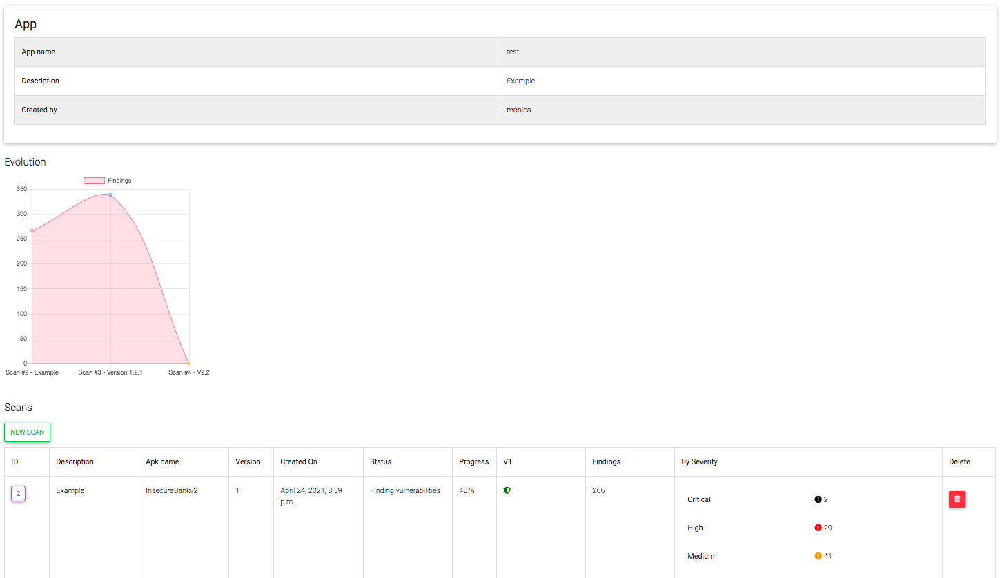
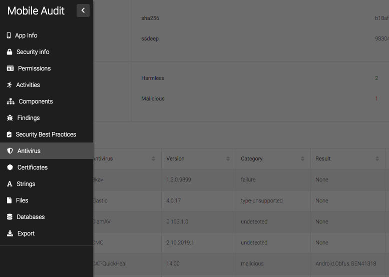
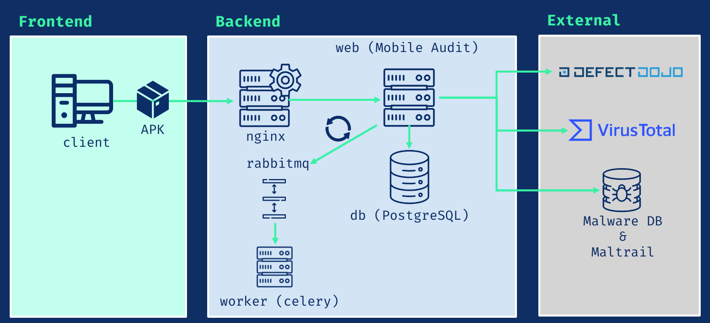
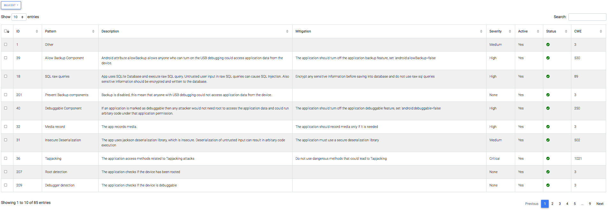
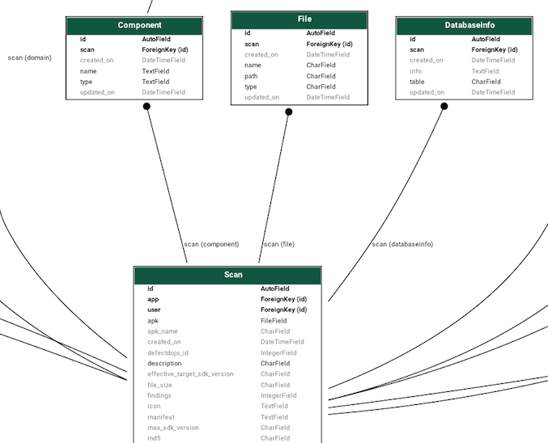
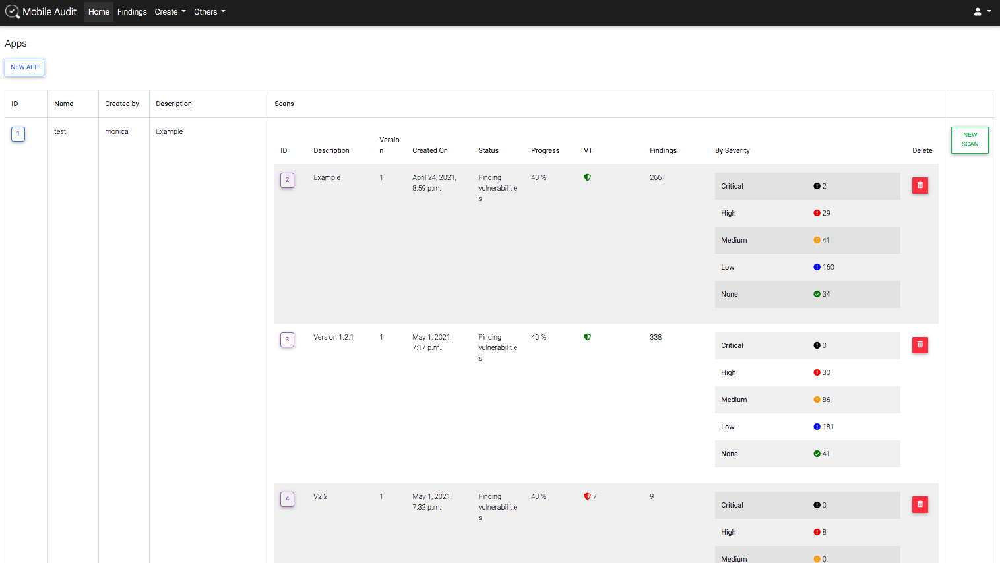
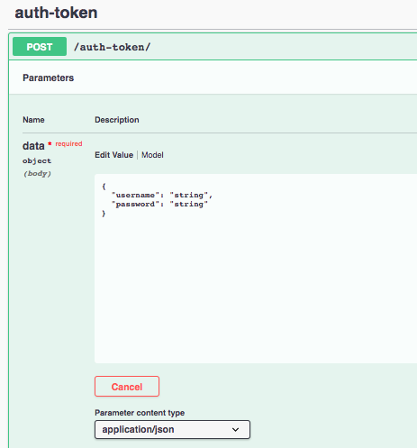
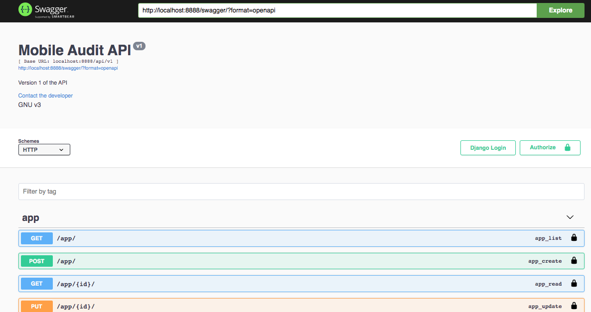
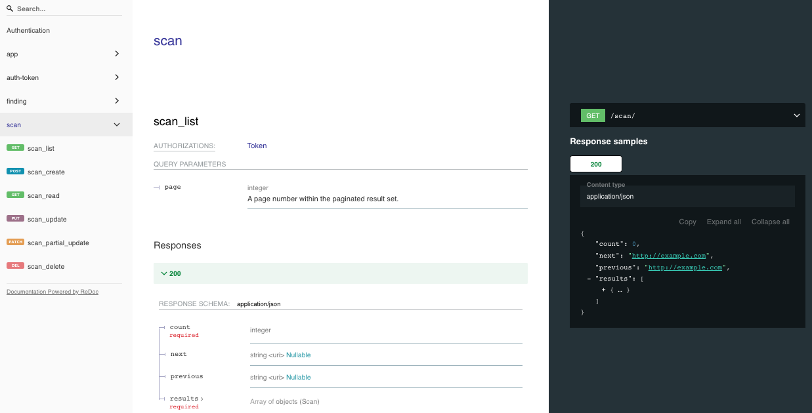

## Auditoría Móvil

**Auditoría Móvil** - Realiza el análisis estático de seguridad (SAST) y análisis de malware para archivos APK de Android

- [Mobile Audit](#mobile-audit)
  - [Componentes](#componentes)
  - [Imágenes base de Docker](#imagenes-base-de-docker)
  - [Características principales](#características-principales)
  - [Patrones](#patrones)
  - [Modelos](#modelos)
    - [Virus Total (API v3)](#virus-total-api-v3)
    - [Defect Dojo (API v2)](#defect-dojo-api-v2)
    - [MalwareDB & Maltrail](#malwaredb--maltrail)
  - [Instalación](#instalación)
  - [Consideraciones para Desarrollo en Windows](#consideraciones-para-desarrollo-en-windows)
  - [API v1](#api-v1)
    - [Uso](#uso)
    - [Swagger](#swagger)
    - [ReDoc](#redoc)
    - [Puntos finales](#puntos-finales)
  - [TLS](#tls)
    - [Requisitos previos](#requisitos-previos)
    - [Configuración de Nginx](#configuración-de-nginx)
    - [Configuración de Docker](#configuración-de-docker)
  - [Variables de entorno](#variables-de-entorno)
---------------------------------------

Aplicación web Django para realizar análisis estático y detectar malware en archivos APK de Android.



En cada uno de los escaneos, se muestra la siguiente información:

* Información de la aplicación
* Información de seguridad
* Componentes
* Hallazgos SAST
* Mejores prácticas implementadas
* Información de Virus Total
* Información de certificados
* Cadenas
* Bases de datos
* Archivos


Para un acceso fácil, hay una barra lateral en la página izquierda del escaneo:



### Componentes



- **db**: PostgreSQL 3.11.5
- **nginx**: Nginx 1.23.3
- **rabbitmq**: RabbitMQ 3.11.5
- **worker**: Celery 5.2.2
- **web**: Aplicación Mobile Audit (Django 3.2.16)

### Imágenes base de Docker

La imagen está basada en python buster. Enlace a la [imagen de Docker Hub](https://hub.docker.com/repository/docker/mpast/mobile_audit)

| Imagen               | Etiquetas | Base                    |
|----------------------|-----------|-------------------------|
| mpast/mobile_audit    | 3.0.0     | python:3.9.16-buster    |
| mpast/mobile_audit    | 2.2.1     | python:3.9.7-buster     |
| mpast/mobile_audit    | 1.3.8     | python:3.9.4-buster     |
| mpast/mobile_audit    | 1.0.0     | python:3.9.0-buster     |

### Características principales

- [x] Usa Docker para un despliegue fácil en un entorno multiplataforma
- [x] Extrae toda la información del archivo APK
- [x] Analiza todo el código fuente en busca de vulnerabilidades
- [x] Todos los hallazgos están categorizados y siguen los estándares **CWE**
- [x] Todos los hallazgos están categorizados e incluyen el **Mobile Top 10 Risk**
- [x] También resalta las **Mejores prácticas en la implementación segura de Android** en el APK
- [x] Los hallazgos pueden ser editados y los **falsos positivos pueden ser clasificados y eliminados**
- [x] Todos los resultados del escaneo pueden ser **exportados a PDF**
- [x] Autenticación de usuario y gestión de usuarios
- [x] API v1 con Swagger y ReDoc
- [x] TLS
- [x] Recarga dinámica de la página (en progreso)
- [ ] Integración con LDAP
- [ ] Exportar a Markdown
- [ ] Exportar a CSV

### Patrones

La aplicación tiene un motor con diferentes reglas y patrones que se utilizan durante la fase de escaneo para detectar vulnerabilidades y/o código malicioso en el APK.

Estos pueden ser activados y desactivados en `/patterns`



Nota: algunos de los patrones codificados son de [apkleaks](https://github.com/dwisiswant0/apkleaks)

### Modelos
La aplicación tiene modelos creados para cada una de las entidades de la información de los escaneos para poder crear relaciones y obtener las mejores conclusiones para cada uno de los APKs.



Para ver el esquema completo de los modelos, ve a [modelos](app/static/models.png)

### Integraciones

#### Virus Total (API v3)

Verifica si se ha realizado un escaneo del APK y extrae toda su información. También, existe la posibilidad de subir el APK si se selecciona una propiedad en el entorno (Deshabilitado por defecto).

#### Defect Dojo (API v2)

Es posible subir los hallazgos al gestor de defectos.

#### MalwareDB & Maltrail

Verifica en la base de datos si existen URLs en el APK relacionadas con Malware.

### Instalación

Usando Docker-compose:

El archivo `docker-compose.yml` proporcionado permite ejecutar la aplicación localmente en desarrollo.

Para construir la imagen local y si hay cambios en el Dockerfile de la aplicación, puedes construir la imagen con:

```sh
docker-compose build
```

Luego, para iniciar el contenedor, ejecuta:

```sh
docker-compose up
```

Opcional: ejecuta en modo separado (sin ver los logs)

```sh
docker-compose up -d
```

Una vez que la aplicación esté en marcha, puedes probarla navegando a: http://localhost:8888/ para acceder al tablero de control.



También hay una versión TLS usando `docker-compose.prod.yaml` que se ejecuta en el puerto 443.


Para usarlo, ejecuta:
```sh
  docker-compose -f docker-compose.prod.yaml up
```

Luego, puedes probar la aplicación navegando a: https://localhost/ para acceder al tablero de control.

Para más información, consulta [TLS](#tls)

Para detener y eliminar los contenedores, ejecuta:

```sh
docker-compose down
```

### Consideraciones para Desarrollo en Windows

Si estás desarrollando en Windows, es necesario realizar algunas modificaciones en el `Dockerfile` y la configuración para manejar correctamente los scripts de entrada (`entrypoint`) y los hosts permitidos:

#### 1. Manejo de finales de línea

Esto se debe a las diferencias en cómo Windows y Unix/Linux manejan los finales de línea:

1. Instalar `dos2unix` en el Dockerfile:
```dockerfile
RUN apt-get update && \
    apt-get install -y dos2unix
```

2. Convertir los scripts de entrada a formato Unix:
```dockerfile
COPY entrypoint/web_entrypoint.sh /web_entrypoint.sh
COPY entrypoint/worker_entrypoint.sh /worker_entrypoint.sh

RUN chmod +x /web_entrypoint.sh /worker_entrypoint.sh && \
    dos2unix /web_entrypoint.sh /worker_entrypoint.sh
```

Estos cambios son necesarios porque:
- Windows usa finales de línea CRLF (\r\n)
- Unix/Linux usa finales de línea LF (\n)
- Los scripts shell en contenedores Linux requieren finales de línea Unix (LF)

#### 2. Configuración de Hosts y CSRF

Para manejar correctamente las peticiones en desarrollo local, necesitas configurar los hosts permitidos y la protección CSRF:

1. En el archivo `.env`:
```env
# Configuración de hosts permitidos
DJANGO_ALLOWED_HOSTS=*
CSRF_TRUSTED_ORIGINS=http://localhost,http://127.0.0.1,http://web,http://app,http://localhost:8888,http://0.0.0.0

# Modo desarrollo
ENV=DEV
```

2. En el archivo `nginx/app.conf`:
```nginx
location / {
    proxy_connect_timeout 500;
    proxy_read_timeout 500;
    proxy_send_timeout 500;
    proxy_pass http://web/;
    proxy_set_header Host $http_host;
    proxy_set_header X-Forwarded-Host $http_host;
    proxy_set_header X-Real-IP $remote_addr;
    proxy_set_header X-Forwarded-For $proxy_add_x_forwarded_for;
    proxy_set_header X-Forwarded-Proto $scheme;
}

listen 8888;
server_name localhost;
```

Esta configuración es necesaria para:
- Permitir peticiones desde localhost y otros hosts de desarrollo
- Manejar correctamente las cabeceras de proxy
- Configurar la protección CSRF adecuadamente
- Evitar errores de "DisallowedHost" y "CSRF verification failed"

Sin estas modificaciones, podrías encontrar errores como:
- "no such file or directory"
- "bad interpreter"
- "Invalid HTTP_HOST header"
- "CSRF verification failed"
- Problemas al ejecutar los scripts de entrada

### API v1

Integración REST API con Swagger y ReDoc.

#### Usage

* Endpoint para autenticar y obtener el token:
`/api/v1/auth-token/`



* Una vez autenticado, usa el encabezado en todas las solicitudes:
`Authorization: Token <ApiKey>`

#### Swagger




#### ReDoc




#### Endpoints

* Una vista JSON de la especificación de la API en `/swagger.json`
* Una vista YAML de la especificación de la API en `/swagger.yaml`
* Una vista swagger-ui de la especificación de la API en `/swagger/`
* Una vista ReDoc de la especificación de la API en `/redoc/`

### TLS

#### Requisitos previos

* Agrega los certificados en `nginx/ssl`
* Para generar un certificado autofirmado:

```sh
openssl req -x509 -nodes -days 1 -newkey rsa:4096 -subj "/C=ES/ST=Madrid/L=Madrid/O=Example/OU=IT/CN=localhost" -keyout nginx/ssl/nginx.key -out nginx/ssl/nginx.crt
```

#### Configuración de Nginx

* TLS - port 443: `nginx/app_tls.conf`
* Standard - port 8888: `nginx/app.conf`

#### Configuración de Docker

Por defecto, hay un volumen en `docker-compose.yml` con la configuración con el puerto 8888 disponible.

```yml
- ./nginx/app.conf:/etc/nginx/conf.d/app.conf
```

**En un entorno de producción**, usa `docker-compose.prod.yaml` con el puerto 443:
```yml
- ./nginx/app_tls.conf:/etc/nginx/conf.d/app_tls.conf
```

### Variables de entorno

Todas las variables de entorno están en un archivo `.env`, hay un `.env.example` con todas las variables necesarias. También están recopiladas en `app/config/settings.py`:

```python
CWE_URL = env('CWE_URL', 'https://cwe.mitre.org/data/definitions/')

MALWARE_ENABLED = env('MALWARE_ENABLED', True)
MALWAREDB_URL = env('MALWAREDB_URL', 'https://www.malwaredomainlist.com/mdlcsv.php')
MALTRAILDB_URL = env('MALTRAILDB_URL', 'https://raw.githubusercontent.com/stamparm/aux/master/maltrail-malware-domains.txt')

VIRUSTOTAL_ENABLED = env('VIRUSTOTAL_ENABLED', False)
VIRUSTOTAL_URL = env('VIRUSTOTAL_URL', 'https://www.virustotal.com/')
VIRUSTOTAL_FILE_URL = env('VIRUSTOTAL_FILE_URL', 'https://www.virustotal.com/gui/file/')
VIRUSTOTAL_API_URL_V3 = env('VIRUSTOTAL_API_URL_V3', 'https://www.virustotal.com/api/v3/')
VIRUSTOTAL_URL_V2 = env('VIRUSTOTAL_API_URL_V2', 'https://www.virustotal.com/vtapi/v2/file/')
VIRUSTOTAL_API_KEY = env('VIRUSTOTAL_API_KEY', '')
VIRUSTOTAL_UPLOAD = env('VIRUSTOTAL_UPLOAD', False)

DEFECTDOJO_ENABLED = env('DEFECTDOJO_ENABLED', False)
DEFECTDOJO_URL = env('DEFECTDOJO_URL', 'http://defectdojo:8080/finding/')
DEFECTDOJO_API_URL = env('DEFECTDOJO_API_URL', 'http://defectdojo:8080/api/v2/')
DEFECTDOJO_API_KEY = env('DEFECTDOJO_API_KEY', '')
```

